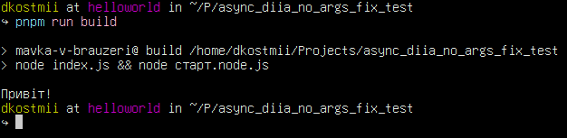
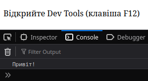

# async_diia_no_args_fix_test

Цей репозиторій містить проект для тестування вирішення
[багу](https://github.com/mavka-ukr/jejalyk/issues/5)
з тривалою дією без аргументів.

## Встановлення

1. Встановіть залежності:

    ```bash
    npm i
    ```

2. Перейдіть у папку [Джеджалика](https://github.com/mavka-ukr/jejalyk)
та виконайте побудову за допомогою скрипта `dist.sh`:

    > **Note**
    > Ми припускаємо, що папка репозиторію Джеджалика знаходиться
    > поруч з цим:
    >
    > ```text
    > jejalyk/
    > async_diia_no_args_fix_test/
    > ```
    >

    ```bash
    # усередині jejalyk/
    ./dist.sh
    ```

3. Перейдіть у папку з цим репозисторієм та запустіть скрипт `copy.sh`:

    ```bash
    ./copy.sh
    ```

    Це скопіює папку `dist/` Джеджалика у тестовий репозиторій.

## Запуск

1. Версія для Node.js:

    ```bash
    npm run build
    ```

    Очікуваний результат:

    

2. Версія для Web:

    ```bash
    npm run serve
    ```

    Слідуйте інструкціям у веб-браузері.

    Очікуваний результат:
    
